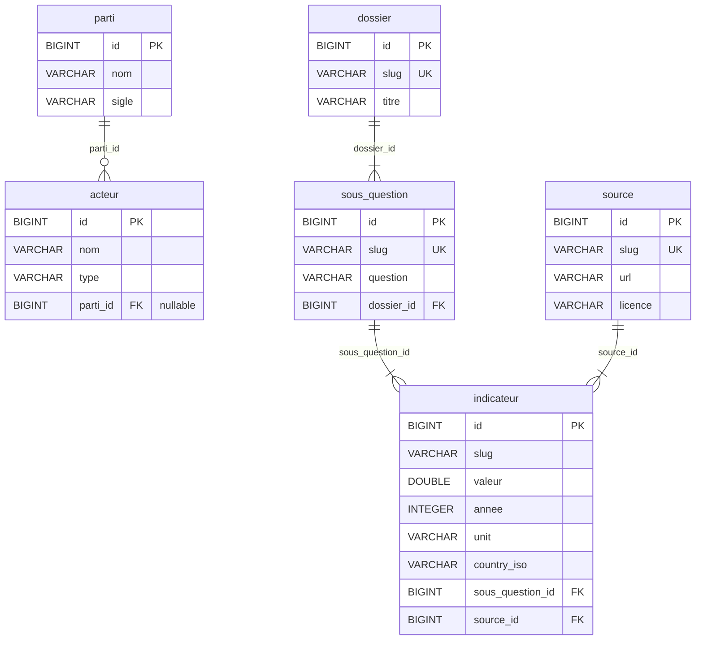

# Modélisation MERISE — AporiaPolis DWH MVP

**Statut** : initial (B-8.1, story G.1 #45)
**Stack cible** : DuckDB+parquet en MVP local, Postgres+Object Storage en
prod (cf. [ADR-0031](../adr/0031-strategie-stockage-mvp.md)).
**Refs** : #45 [G.1], ADR-0031, `migrations/001_init_schemas.sql`.

Cette modélisation initiale couvre 6 entités structurantes du domaine
AporiaPolis. Elle sera étendue par briefs ultérieurs au fur et à mesure
que d'autres dossiers et sources d'ingestion arrivent (G.2, G.3, et
au-delà). Le format MERISE est conservé pour cohérence avec le cadre
pédagogique de la certification Data Engineer Simplon et pour servir
le comité de relecture humain strate 2 (EPIC D).

## 1. MCD — Modèle Conceptuel de Données

Les 6 entités initiales et leurs relations conceptuelles :

```mermaid
erDiagram
    PARTI ||--o{ ACTEUR : "affilie"
    DOSSIER ||--|{ SOUS_QUESTION : "se decompose en"
    SOUS_QUESTION ||--|{ INDICATEUR : "est mesuree par"
    SOURCE ||--|{ INDICATEUR : "fournit la valeur de"

    ACTEUR {
        identifiant id
        nom
        type
    }
    PARTI {
        identifiant id
        nom
        sigle
    }
    DOSSIER {
        identifiant id
        slug
        titre
    }
    SOUS_QUESTION {
        identifiant id
        slug
        question
    }
    INDICATEUR {
        identifiant id
        slug
        valeur
        annee
    }
    SOURCE {
        identifiant id
        slug
        url
    }
```

### Cardinalités

- **PARTI 1..1 — 0..N ACTEUR** : un acteur est affilié à au plus un
  parti à un instant T (MVP : pas d'historisation d'affiliation, cas
  multi-temporel reporté à un futur slice avec snapshots — ADR-0027
  réservée pour cette extension). Un parti rassemble 0..N acteurs.
- **DOSSIER 1..1 — 1..N SOUS_QUESTION** : un dossier éditorial se
  décompose en au moins une sous-question analytique ; chaque
  sous-question appartient à un seul dossier.
- **SOUS_QUESTION 1..1 — 1..N INDICATEUR** : une sous-question est
  mesurée par au moins un indicateur ; chaque indicateur répond à
  une seule sous-question.
- **SOURCE 1..1 — 1..N INDICATEUR** : MVP B-8 = un indicateur a
  exactement une source (le contrat figé G.3 confirme ce choix).
  Cas multi-source (triangulation) reporté à un futur slice.

### Note sur les acteurs sans parti

L'acceptance G.1 ne précise pas si `ACTEUR.parti_id` est nullable ou
NOT NULL. Décision B-8.1 : **nullable** (un journaliste,
un expert indépendant, ou un acteur en transition partisane peut
exister sans parti). À reconfirmer en revue strate 2 (EPIC D).

## 2. MLD — Modèle Logique de Données

Le MCD traduit en relations (tables) avec clés primaires et étrangères :



### Notes de traduction MCD → MLD

- Les relations 1..N se traduisent par une clé étrangère côté « N »
  (acteur.parti_id, sous_question.dossier_id, etc.).
- Aucune table d'association n'est nécessaire au MVP B-8 (toutes les
  cardinalités sont au plus 1..N). Une éventuelle table d'association
  acteur ↔ parti historisée apparaîtrait lors de l'ouverture des
  snapshots (ADR-0027 future).
- L'unicité conceptuelle des slugs métier est rendue par contrainte
  UNIQUE explicite (UK). Le slug de l'indicateur n'est pas UK seul
  car le même indicateur peut exister pour plusieurs (annee, country_iso).
  Une contrainte composite est définie au MPD.

## 3. MPD — Modèle Physique de Données

Spécialisation DuckDB du MLD avec types, contraintes, et placement
par schéma. Les indexes sont *envisagés* et non *décidés* — ils seront
ajoutés au moment où une charge réelle le justifiera (mesure, pas
intuition).

### 3.1 Placement par schéma

| Table | Schéma | Justification |
|---|---|---|
| `acteur` | `app` | Référentiel métier transverse, géré par processus éditorial, peu volumineux, partagé entre tous les dossiers. |
| `parti` | `app` | Idem `acteur` — référentiel partisan transverse. |
| `dossier` | `app` | Référentiel éditorial transverse (un dossier alimente plusieurs sous-questions). |
| `sous_question` | `app` | Référentiel analytique transverse (transversal sur dossiers et indicateurs). |
| `source` | `app` | Référentiel documentaire transverse (réutilisable par plusieurs indicateurs). |
| `indicateur` | `marts` | Produit d'analyse final, consommé par l'API B-8.4 et par le front B-8.5. Le contrat de colonnes figé en G.3 (slug, year, value, unit, source, country_iso) s'applique à cette table dans `marts`. |

Les schémas `raw`, `staging`, `intermediate`, `audit_log` sont créés
par la migration 001 mais ne reçoivent pas encore de tables en B-8.1.
Leurs tables seront ajoutées par les briefs suivants :

- `raw.owid_co2_emissions` en B-8.2 (Dagster ingest).
- `staging.stg_owid__co2_emissions` en B-8.3 (dbt staging).
- `intermediate.int_*` selon besoin en B-8.3 (peut rester vide en MVP).
- `audit_log.*` au premier endpoint API mutant (post-B-8).

### 3.2 Types et contraintes

Types DuckDB utilisés. Tous portables sur Postgres sans modification
(`BIGINT`, `VARCHAR`, `DOUBLE`, `INTEGER`, `TIMESTAMP`).

#### `app.parti`

- `id BIGINT PRIMARY KEY` — identifiant interne.
- `nom VARCHAR NOT NULL` — nom complet.
- `sigle VARCHAR` — sigle court, nullable.

#### `app.acteur`

- `id BIGINT PRIMARY KEY` — identifiant interne.
- `nom VARCHAR NOT NULL` — nom de l'acteur.
- `type VARCHAR NOT NULL` — typologie (politique / journaliste / expert / lobbyiste / autre — domaine ouvert pour ne pas figer prématurément).
- `parti_id BIGINT REFERENCES app.parti(id)` — nullable.

#### `app.dossier`

- `id BIGINT PRIMARY KEY` — identifiant interne.
- `slug VARCHAR NOT NULL UNIQUE` — identifiant lisible humain (ex. `medias`, `climat`).
- `titre VARCHAR NOT NULL` — titre éditorial.

#### `app.sous_question`

- `id BIGINT PRIMARY KEY` — identifiant interne.
- `slug VARCHAR NOT NULL UNIQUE` — identifiant lisible humain.
- `question VARCHAR NOT NULL` — formulation en langage naturel.
- `dossier_id BIGINT NOT NULL REFERENCES app.dossier(id)`.

#### `app.source`

- `id BIGINT PRIMARY KEY` — identifiant interne.
- `slug VARCHAR NOT NULL UNIQUE` — identifiant lisible humain (ex. `owid`, `insee`, `hatvp`).
- `url VARCHAR NOT NULL` — URL canonique de la source.
- `licence VARCHAR NOT NULL` — licence d'usage (ex. `CC BY 4.0`).

#### `marts.indicateur`

- `id BIGINT PRIMARY KEY` — identifiant interne.
- `slug VARCHAR NOT NULL` — identifiant lisible humain de l'indicateur.
- `valeur DOUBLE NOT NULL` — valeur numérique.
- `annee INTEGER NOT NULL` — année de la mesure.
- `unit VARCHAR NOT NULL` — unité (ex. `Mt CO2`, `pourcentage`).
- `country_iso VARCHAR(3) NOT NULL` — code ISO 3166-1 alpha-3 (ex. `FRA`).
- `sous_question_id BIGINT NOT NULL REFERENCES app.sous_question(id)`.
- `source_id BIGINT NOT NULL REFERENCES app.source(id)`.
- `UNIQUE (slug, annee, country_iso, source_id)` — un indicateur est
  unique pour un (slug, année, pays, source) donné.

### 3.3 Indexes envisagés (non décidés)

Aucun index secondaire n'est créé en B-8.1. Les indexes envisagés
pour activation future, sur observation d'une charge réelle :

- `marts.indicateur (slug, country_iso, annee)` si l'API B-8.4 reçoit
  beaucoup de requêtes filtrées par (slug + pays + plage d'années).
- `app.sous_question (dossier_id)` si jointure dossier ↔ sous_question
  devient un point chaud sur listing API.
- `app.acteur (parti_id)` si jointure acteur ↔ parti devient un point
  chaud (peu probable à court terme, volumétrie restant faible).

P6 (simplicité d'abord) : pas de pré-engineering d'indexes. Mesure
avant action.

### 3.4 Création des tables

Les tables ne sont **pas** créées par `migrations/001_init_schemas.sql`
(qui ne crée que les schémas). Elles seront introduites par les
migrations suivantes :

- `migrations/002_create_app_referentiels.sql` (B-8.1 ou ultérieur)
  pour `parti`, `acteur`, `dossier`, `sous_question`, `source`.
- `migrations/003_create_marts_indicateur.sql` (B-8.3 préféré, ou
  B-8.1 si pertinent) pour `marts.indicateur`.

Décision B-8.1 : la migration 001 se limite aux **schémas**
(critère verbatim acceptance G.1 rebaselinée). Les migrations de
tables sont reportées au moment où elles sont consommées par un
asset Dagster ou un modèle dbt — P6 simplicité, P7 chirurgical.
Cette modélisation MPD reste néanmoins versionnée maintenant pour
servir de contrat aux briefs B-8.2 et B-8.3.

## 4. Migration vers Postgres (EPIC B)

L'ADR-0031 prévoit que cette modélisation MERISE et les migrations
SQL standard portables seront rejouées sans réécriture sur Postgres
managé Scaleway au moment d'EPIC B. Les types utilisés (`BIGINT`,
`VARCHAR`, `DOUBLE`, `INTEGER`) sont identiques DuckDB↔Postgres.
Seul le runtime change (moteur, fichier vs serveur, profil dbt).

Une ADR EPIC B dédiée bouclera la stratégie de migration concrète
(dual-write transitoire, cutover unique, ou expansion DuckDB en
prod si l'expérience MVP le justifie). Cette modélisation est
agnostique à ce choix futur.

## 5. Historique des révisions

| Date | Version | Auteur | Motif |
|---|---|---|---|
| 2026-05-17 | 1.0 | Sam + contributeur IA (B-8.1) | Initial — 6 entités, DuckDB MVP. |

Modifications futures attendues : ajout d'entités au fur et à mesure
des slices EPIC G (sources INSEE, HATVP, ARCOM, etc.), ouverture de
l'historisation des affiliations partisanes via snapshots
(ADR-0027 réservée), introduction des tables d'`audit_log` au premier
endpoint mutant.
